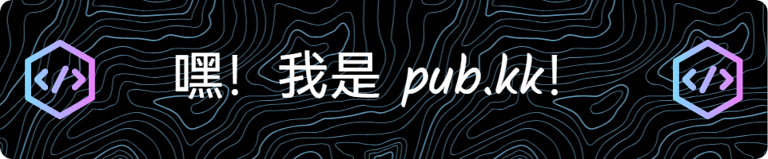

  <!-- knock code pictures 敲代码的图片 -->
  <picture>
    <source media="(prefers-color-scheme: dark)" srcset="https://cdn.jsdelivr.net/gh/sun0225SUN/sun0225SUN/assets/images/coding.gif" />
    <source media="(prefers-color-scheme: light)" srcset="https://cdn.jsdelivr.net/gh/sun0225SUN/sun0225SUN/assets/images/developer.svg" height="225px" />
    
  </picture>

  <!-- for beauty 留个空行好看点 -->
  
&nbsp;

 

<!--
**2427272221/2427272221** is a ✨ _special_ ✨ repository because its `README.md` (this file) appears on your GitHub profile.

Here are some ideas to get you started:

- 🔭 I’m currently working on ...
- 🌱 I’m currently learning ...
- 👯 I’m looking to collaborate on ...
- 🤔 I’m looking for help with ...
- 💬 Ask me about ...
- 📫 How to reach me: ...
- 😄 Pronouns: ...
- ⚡ Fun fact: ...
-->

<h3 align="center">Every minute counts.</h3>

  

- 📫 How to reach me **fangkangkang680@gmail.com**

<h3 align="left">Connect with me:</h3>

<h3 align="left">Languages and Tools:</h3>

                                                 

<!-- for beauty 留个空行好看点 -->

 

  
  

<picture>
  <source media="(prefers-color-scheme: dark)" srcset="https://raw.githubusercontent.com/Peter-JXL/Peter-JXL/output/github-contribution-grid-snake-dark.svg">
  <source media="(prefers-color-scheme: light)" srcset="https://raw.githubusercontent.com/Peter-JXL/Peter-JXL/output/github-contribution-grid-snake.svg">
  
</picture> 

